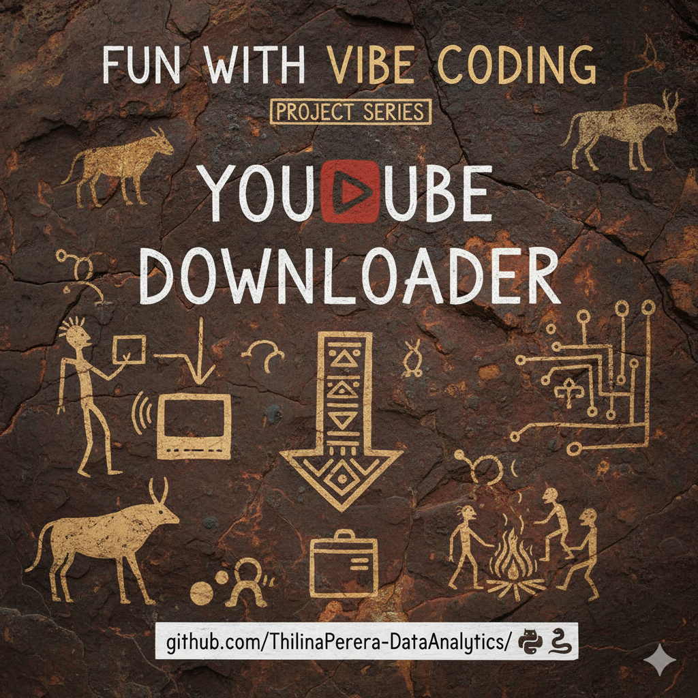
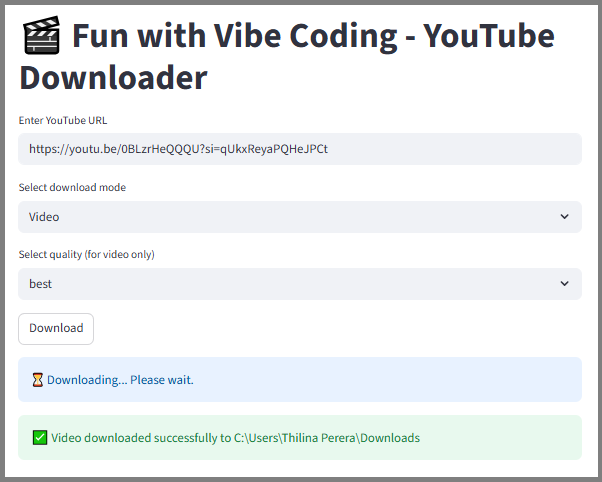

# 🎵 YT Downloader
```
Project Series - Fun with Vibe Coding
Project 01 
```


A lightweight **YouTube Downloader App** built with **Streamlit** and **yt-dlp**, supporting downloads of single videos or playlists in **audio (.mp3)**, **video-only**, or **merged (audio + video)** formats.  
All downloads are automatically saved to your **default Windows Downloads** folder.

---

## 🧩 Features

- 🎬 Download **Single Videos** or **Playlists**
- 🎧 Choose between:
  - **Audio only (.mp3)**
  - **Video only**
  - **Merged (audio + video)**
- 📺 Supports **1080p** and **720p** resolutions
- 💾 Files automatically saved to the Windows **Downloads** folder
- ⚙️ Uses `ffmpeg` for merging and conversion
- 🖥️ Simple UI built with Streamlit

---

## 🗂️ Project Structure

```

Fun_with_Vibe_Coding_YT_Downloader/
│
├── app.py                # Streamlit app - UI for download options
├── yt_downloader.py      # Core download logic using yt-dlp and ffmpeg
├── requirements.txt      # Dependencies list
└── README.md             # Project documentation

````

---

## ⚙️ Setup Instructions

### 1. Clone the Repository
```bash
git clone https://github.com/YourUsername/Fun_with_Vibe_Coding_YT_Downloader.git
cd Fun_with_Vibe_Coding_YT_Downloader
````

### 2. Create and Activate a Virtual Environment

```bash
conda create -n yt_downloader python=3.11 -y
conda activate yt_downloader
```

or using `venv`:

```bash
python -m venv yt_downloader_env
yt_downloader_env\Scripts\activate
```

### 3. Install Dependencies

```bash
pip install -r requirements.txt
```

### 4. Install and Configure FFmpeg

* **Windows Installation:**

  1. Download from [ffmpeg.org/download.html](https://ffmpeg.org/download.html#build-windows)
  2. Extract and copy the `bin` folder path (e.g., `C:\ffmpeg\bin`)
  3. Add this path to your **System Environment Variables → Path**
  4. Verify installation:

     ```bash
     ffmpeg -version
     ```

---

## ▶️ Run the Streamlit App

```bash
streamlit run app.py
```

The app will open automatically in your browser at:
👉 `http://localhost:8501`



---

## 💡 Usage Guide

1. Select **Single Video** or **Playlist**
2. Paste the **YouTube URL**
3. Choose output format:

   * Audio (.mp3)
   * Video only
   * Merged (audio + video)
4. Select resolution (**1080p** or **720p**)
5. Click **Download**
6. Files are saved automatically to your **Downloads** folder

---

## 🧰 Tech Stack

| Component       | Technology |
| --------------- | ---------- |
| Frontend UI     | Streamlit  |
| Backend Logic   | Python     |
| Downloader      | yt-dlp     |
| Media Processor | ffmpeg     |

---

## 🚀 Future Enhancements

* Progress tracking during downloads
* Auto file renaming for duplicates
* Optional custom download location
* Enhanced playlist UI and queue display

---


### 👨‍💻 Author
**Thilina Perera/ Data with TP**
```
📌 Data Science/ Data Analytics
📌 Machine Learning, Deep Learning, LLM/LMM, NLP, and Automated Data Pipelines Explorer
``` 
---

## 📄 License

This project is open-source and available under the **MIT License**.